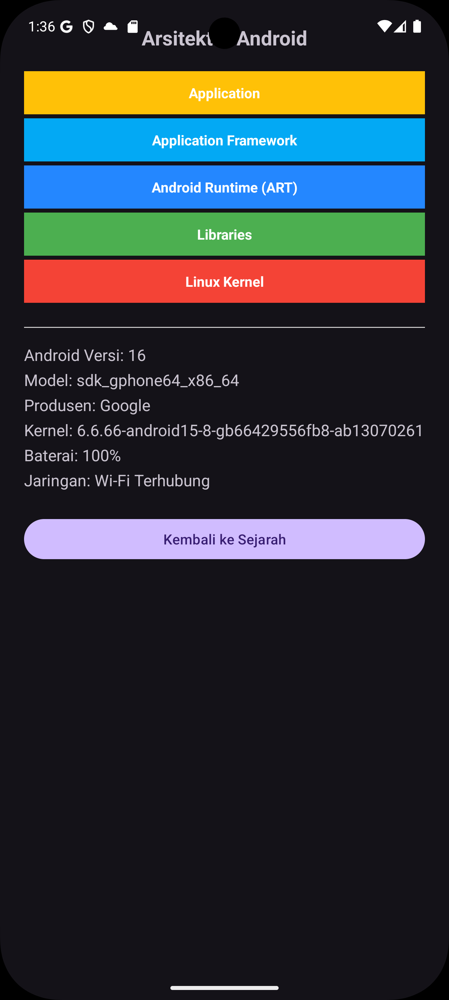
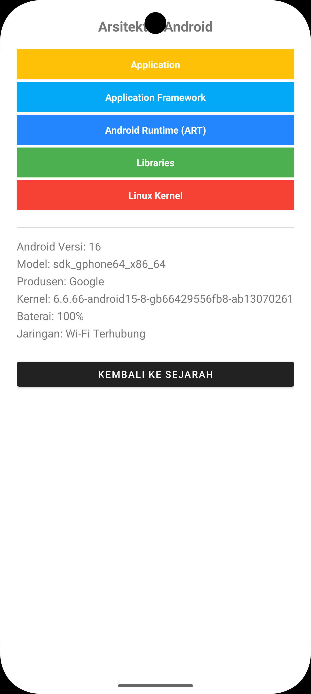
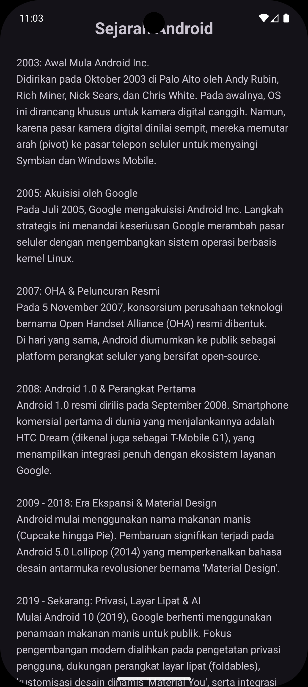
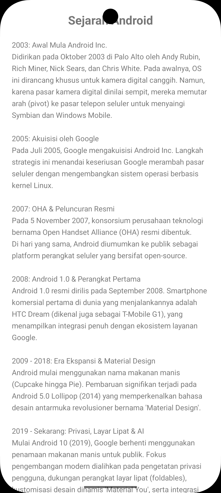

# Sejarah Android - Pemrograman Mobile
## Tugas Kelompok Pemrograman Mobile 
Nama Anggota Kelompok: 
1. M. Anshary (2410817310008)<br>
2. Athaya Laily Syafitri (2310817220008)<br>
3. Muhammad Ghazi Rakhmadi (2410817310009)<br>
4. Akhmad Daffa Azzikri (2410817110002)<br>
### Deskripsi  
Deskripsi : Aplikasi ini merupakan aplikasi yang berisikan informasi sejarah android dari tahun ke tahun dan arsitektur android dilengkapi dengan informasi device serta dilengkapi dengan fitur gelap dan terang
### Cara Menjalankan
Cara Menjalankan : 
1. Clone repository ini menggunakan terminal atau CMD
   ```
   git clone https://github.com/muh-ghazii/Kelompok6_SejarahAndroid.git
3. Buka folder repository yang sudah diclone dengan menggunakan IDE Android Studio
4. Tunggu proses Gradle Sync selesai.
5. Lakukan klik Run pada bagian atas atau menggunakan tombol Shift+F10
6. Aplikasi berhasil dijalankan menggunakan emulator bawaan dari IDE <br>

<p align="center">
  
  
  
   
</p>
